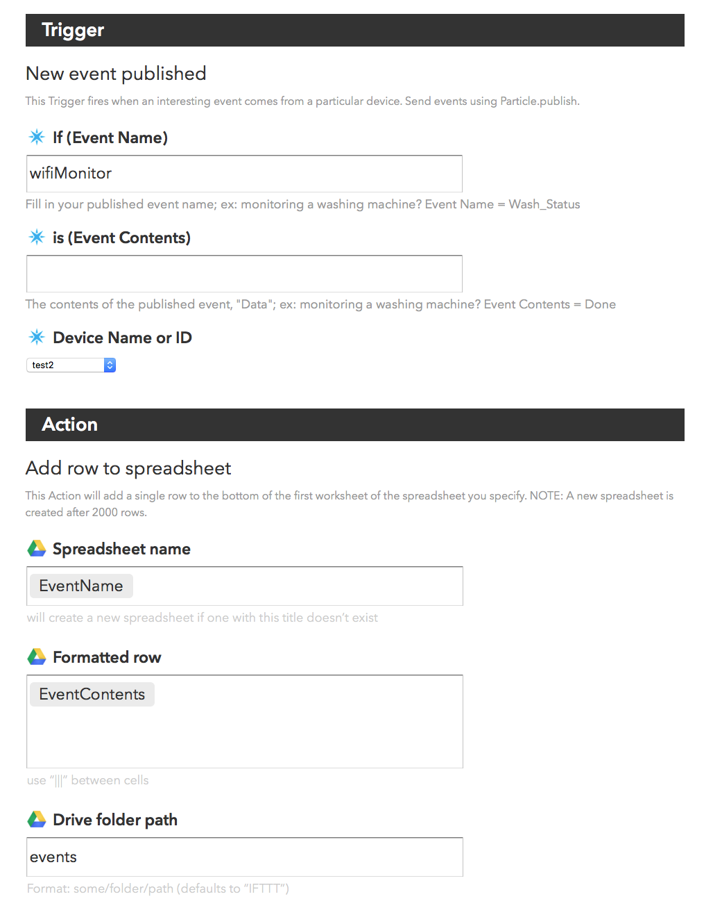
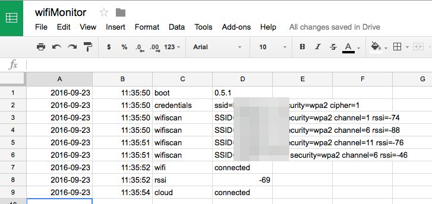

# Wi-Fi Monitor

*A Particle Photon program to monitor Wi-Fi for debugging purposes*

### What is this?

The idea is that sometimes you might have Wi-Fi connectivity issues that you are trying to debug. You can see that the Photon occasionally starts blinking cyan or green before going back to breathing cyan, but what's going on? How often is it doing it?

This program logs a bunch of data and saves it in retained memory (preserved across reboots) and uploads it using events when there is a cloud connection. One handy thing you can do is store the events into a Google spreadsheet, described below.

The program:

- Lists available Wi-Fi networks, including their SSID, channel, and RSSI (signal strength) when booted the first time
- Lists the currently configured Wi-Fi networks
- Logs when the cloud connection goes up or down
- Logs when the Wi-Fi connection goes up or down
- Logs when the RSSI changes by more than &plusmn;10
- When there is no cloud but there is Wi-Fi, pings the Google DNS (8.8.8.8) and does a DNS lookup of api.particle.io to see if there's external connectivity

Of course you can edit the program to log whatever data you want.

### Running the program

The program consists of the three files: 

- wifimonitor.cpp (the main program)
- logbuffer.cpp (utility to manage the memory buffer)
- logbuffer.h

You can compile and upload this using whatever development environment you prefer. You can download the files here: 

[https://github.com/rickkas7/wifimonitor] (https://github.com/rickkas7/wifimonitor)

If you want to use the [Particle CLI] (http://particle.io/cli) to compile, you could use the command:

```
particle compile photon --target 0.4.9 wifimonitor.cpp logbuffer.cpp logbuffer.h --saveTo wifimonitor.bin
```
	

### Connecting the output to Google Sheets

The program generates events that can be viewed in the [console] (https://console.particle.io) but one of the neat things you can do is use [IFTTT] (https://ifttt.com) to write the data to a Google spreadsheet. I got the idea from a [Particle community forum post] (https://community.particle.io/t/example-using-ifttt-google-drive/8908).

Create a new recipe.

Select **Particle** as your trigger channel, then choose **New event published** as the trigger.

Use `wifiMonitor` as the **Event Name** and leave the **Event Contents** field blank.

Create the Trigger.

For the that, select **Google Drive**. As the Action, select **Add row to spreadsheet**.

You can manually set the spreadsheet name, or use **EventName** to use wifiMonitor.

Set the **Formatted row** to: `EventContents` only, deleting the other things that apppear by default. 

And that's it! It looks like this when done:



And here's what the spreadsheet looks like as it's filling in.




